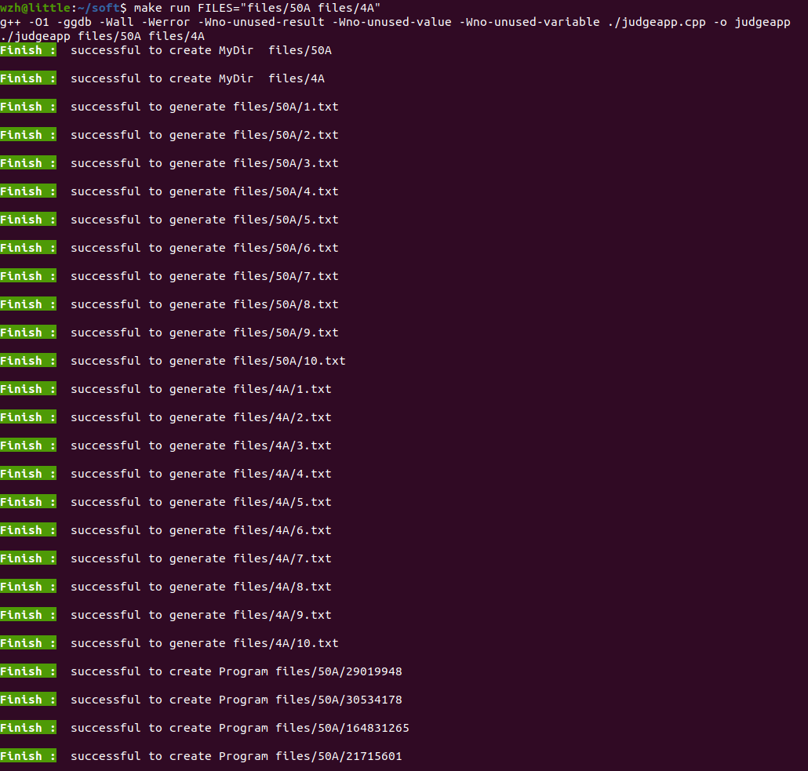
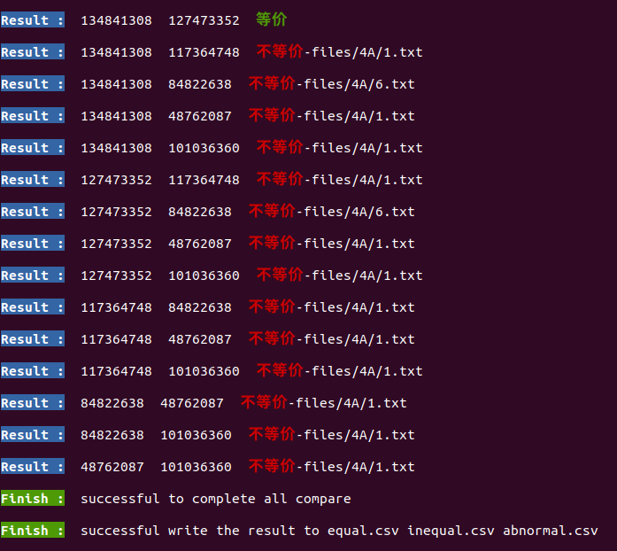
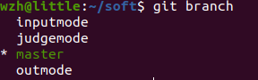
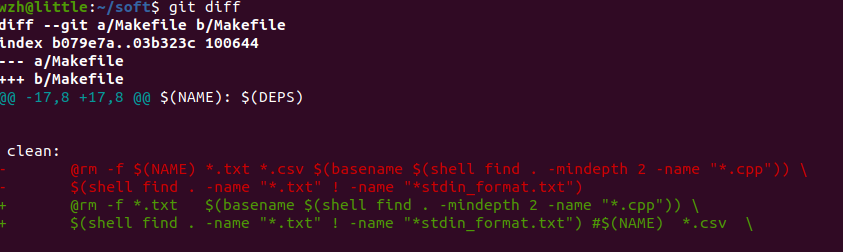

# Software Engineering Lab  
---------------------------
NJU Software Engineering Lab(Fall 2022)  
程序等价性判断工具(基于ubuntu系统，采用C++开发)  
### 运行方式  
在files文件夹中放置了input实例文件夹(50A,4A),如果需要其它的输入样例只需将其复制到files文件夹下  
* 输入：文件夹名称(支持相对路径与绝对路径)
* 输出：三个文件equal.csv,unequal.csv,abnormal.csv  

在本实验中，提供了用于编译运行的makefile  

> make                                
> 进行程序的编译,并且会自动git add和git commit

> make run FILES=\<directorys\>          
> 示例:make run FILES="files/50A files/4A"。运行程序，其中FILES表示运行的输入文件夹.当有多个文件夹时，之间用空格隔开，默认输入为files/50A  

> make clean 

运行结果demo截图：




### 系统架构
本项目代码实现过程按功能分为三个模块：**输入模块**、**运行比较模块**、**输出模块**  
代码整体思路为：  
* 输入模块接受输入的文件夹名称，从而创建输入类对象`MyDir`.该对象检索自身包括的`.cpp`文件,并将其名称记录下来，然后再根据`stdin_format.txt`文件产生用于后续判断的输入文件；  
* 运行比较模块接受`.cpp`文件名，创建运行程序类对象`MyProgram`.该类可以对其`.cpp`文件进行编译产生可执行文件，然后设置该对象的输入文本文件以及输出文本文件，就可运行对应的程序产生结果。`compare()`函数就是对于同一输入文件，比较两个程序产生的输入结果是否相同。再进一步我们实现了`isequal()`函数用于比较两个程序是否等价(即对于每个输入文件，两个程序产生的输出都相同)，并将结果记录在`comresult`结构体中。
* 最终的输入模块就是将运行比较模块产生的结果都保存下来，设置用于输出的三个文件名称后，根据每条记录的比较结果将其分别写入对应的`.csv`文件中。  
  
具体的，我们分别来看每个模块对应的类的内部实现(只包含函数定义及作用，具体实现参照对应的代码文件)。  
##### 输入模块（a.h）
```
class MyDir
{
public:
     //构造函数
     MyDir():name("undefine"){};
     MyDir(const char *s,const char *s2 = "stdin_format.txt");
     
     void read_dir(string fileDir);       //遍历文件夹，搜索记录.cpp文件
     const char* getfile(int ord);        //返回第ord个文件的名称
     void generatestdin(const char *output);  //产生输入txt文本文件
     string dirname();                     //返回文件夹名称
     int number();                         //返回iu文件(.cpp)个数
     int Stdin_num(); 
     MyDir& operator = (const MyDir& src); 

private:
    string name;                //文件夹名称
    vector<string> files;       //该文件夹下包含的文件名（.cpp）
    int numfile=0;              //该文件夹下包含的文件(.cpp)个数
    string Stdinformat;         //输入格式文件名
    int stdin_num;              //程序运行所需的输入数据个数
};
```

##### 运行比较模块（b.h）
```
class MyProgram
{
public:
    //构造函数
    MyProgram():name("undefine"){};
    MyProgram(const char* s,const char* p="files/",const char* i="input.txt");

    void Inputchange(const char *name);  //设置用于输入的txt文件名
    void Run(const char* output);        //运行程序，将结果放在output文件中
    string Name() const ;                //返回文件名
    void Numinput(const string& in);     //判断所需输入数据的个数

    //对于同一输入文件，比较两个程序产生的输入结果是否相同
    friend int Compare(const char* , MyProgram&, MyProgram&);  
    
    MyProgram& operator = (const MyProgram& src);
    int input_num=0;
private:
    
    string name;    //程序文件名
    string path;    //文件路径
    string input;   //输入文件名
    string output;  //输出文件名
    
};

//比较两个程序是否等价
int isequal(MyProgram& a, MyProgram& b,const string *s,const int n)
```

##### 输出模块（c.h）
```
//比较结果记录
struct comresult{                    
    string file1;
    string file2;
    int flag;    //1代表相等，0代表不相等，-1代表文件不正常
};

class MyOut
{
public:
    //构造函数
    MyOut(const char* s1="equal.csv",
      const char* s2="inequal.csv",const char* s3="abnormal.csv");

    void Add(const char* f1,const char* f2,int t);  //增加一条结果
    void Print();                                   //将结果写入文件夹中

private:
    vector <struct comresult> Result;               //比较结果记录容器
    int number=0;                                   //数量
    string eq;                                      //记录等价结果的文件名
    string neq;                                     //记录不等价结果的文件名
    string abn;                                     //记录不正常程序的文件名
};
```
### git过程
本项目的git网址为：https://github.com/littlewzh/software.git

git分支：


git diff:


git add 和git commit:这一部分就不展示运行结果截图，而是展示makefile中的代码
```
git:
	@git add -A --ignore-errors
	@while (test -e .git/index.lock); do sleep 0.1; done
	@(uname -a && uptime) | git commit -F - -q --no-verify --allow-empty
	@sync
```
### 未能解决的问题
（希望老师能进行解惑或给予一定的帮助）
预期我们希望实现的是当输入输出都相同时才为等价，所以需要判断每个程序所需的输入数据个数。  
为此，我在`Myprogram`类中实现了一个用于判断输入数据个数的方法：`void Numinput(const string& in); `。该方法主要通过调用`test.sh`脚本判断，核心方法就是逐步给输入：
> `timeout 1 ./program <tmp.txt >/dev/null 2>&1`
> `echo "result:$?"`  

但问题在于采用重定向的方法指定输入文件，当输入数据个数不够时，程序并不会卡住，而是自动选用编译器给定的默认值，从而无法通过`timeout`判断。

**上述问题没有解决，无法判断程序的输入个数。所以当程序的输入具有包含关系，且输出相同时依旧认为两者等价。**
