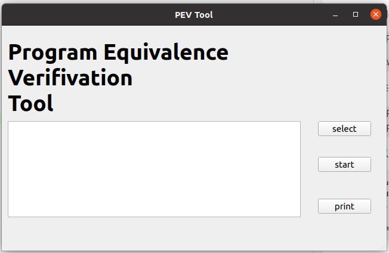
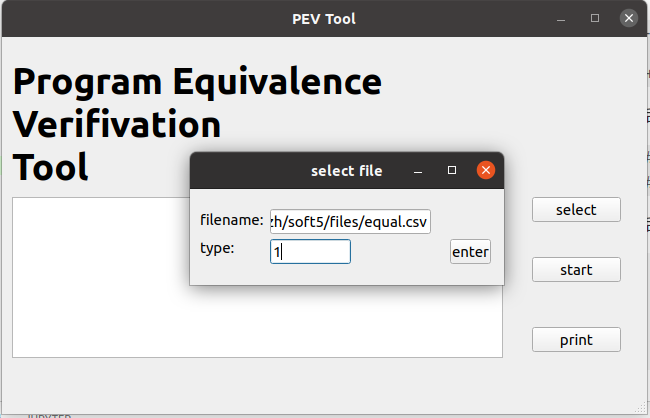
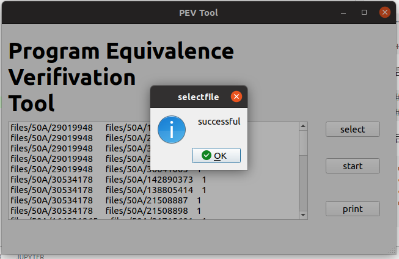
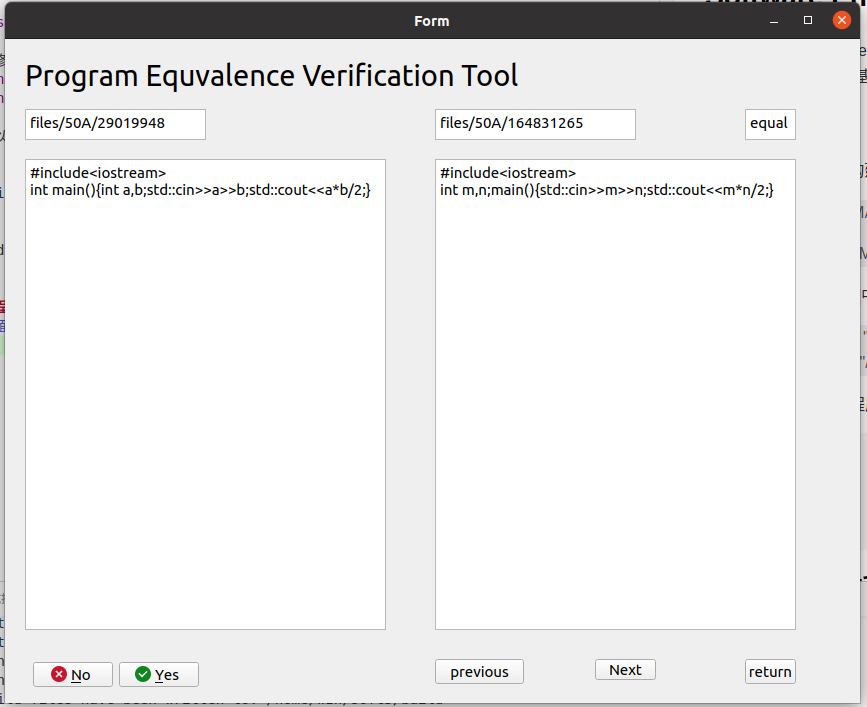
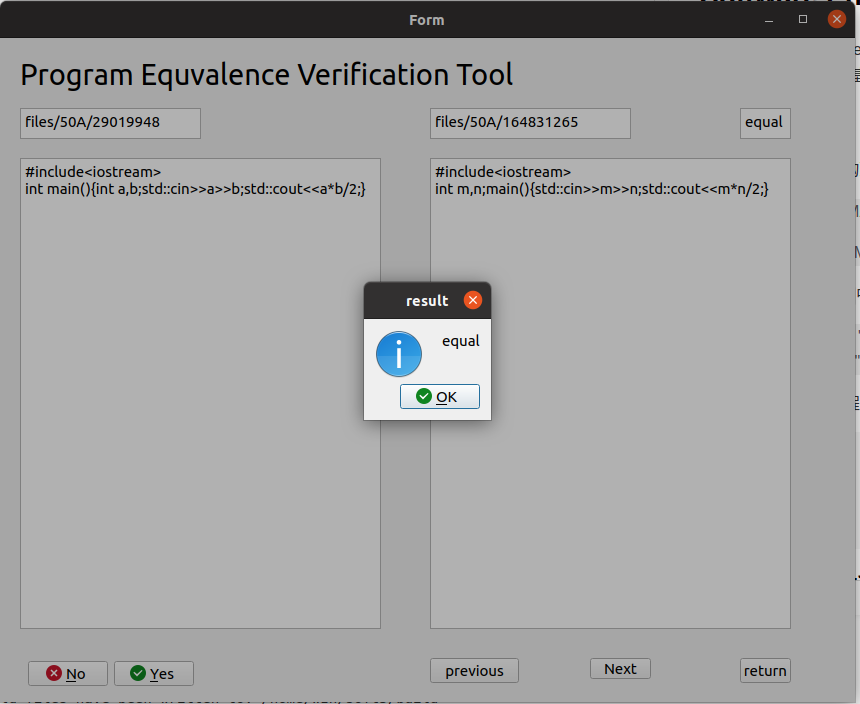
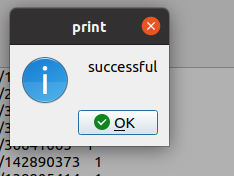

## Software Engineering Lab5
NJU Software Engineering Lab(Fall 2022)
程序等价性确认工具(基于ubuntu系统，采用C++，qt开发)

### 1、运行方式
该项目采用cmake的构建方式，想要运行构建程序需要先修改CMakeLists.txt中的路径  

> ---  list(APPEND CMAKE_PREFIX_PATH "/home/wzh/Qt5.14.2/5.14.2/gcc_64")
> 
> +++list(APPEND CMAKE_PREFIX_PATH "<你的ubuntu中QT的路径>")
>   
然后需要修改`main.h`中的宏定义,将下列的宏定义修改为你的项目文件夹的绝对路径
> #define PWDPATH "/home/wzh/soft5/"
> #define FILEPATH "/home/wzh/soft5/"  

最后就可以运行构建程序
```
> mkdir build
> cd build
> cmake ..
> make
> ../qtdemo
```  

### 2、程序内容分析
有关qt相关的代码就不在此处介绍，大部分都是qt提供的很好的class，以及图形界面编程

##### 输入类介绍
在通过Add（）函数导入csv内容后，我实现的程序对推荐逻辑比较简单，就是根据csv的序列号进行推荐
```
class MyIn
{
public:
    MyIn():pool(),ord(0){};
    void Add(const string &filename,int flag);
    struct comresult getone(int ord);
    void Print();
    int Size();
    int Ord();
    int Ordadd();
    int Orddown();
private:
    vector<struct comresult> pool;    //存储csv导入的结果，并在图形界面中显示
    
    //用于记录当前所比较程序对序列号，便于进行前后切换
    int ord;                          
    
};

```
##### 输出类介绍
该实现与实验四中的输出类基本相似，唯一不同的是，我采用了`map<struct out,int > mm;`数据结构对输出结果进行保存，这样的好处是，非常高效保证存储的结果不会有重复
```
class MyOu
{
public:
    MyOu(string s1="equal.csv",string s2="inequal.csv",string s3="abnormal.csv")
       :eq(PWDPATH+s1),neq(PWDPATH+s2),abn(PWDPATH+s3)
       {mm.clear();}
       //~MyOut();
       void Add(string f1,string f2,int t);
       void Print();
private:
    map<struct out,int > mm;
    int number=0;
    string eq;
    string neq;
    string abn;
};
```
### 3、程序执行过程
* 开始界面


* 点击右侧的 **selcet** 按键，导入`.csv`文件,输入文件的绝对路径名，以及它的类型（1表示等价文件，0表示不等价文件）
  
* 点击**enter** 按键确定导入，导入成功后会有消息提示，并且能够在左下方的文本框中看到导入的内容
 

* 点击右侧的 **start** 按键，开始进行等价确认，在下面的界面中表示：
> 第一排：文件名------文件名-------程序等价性判断工具给出的结果 
> 第二排：文件内容-----文件内容
> 第三排：选择是否等价-------上一个程序对--------下一个程序对------返回主界面

 

* 例如，点击**yes**按钮

 

* 返回后点击右侧的 **print** 按键，就可以将确认的结果写入对应的文件中
   


### 4、GIT过程
此项目的git过程与实验四基本相同，故本实验报告就不再重复展示

  